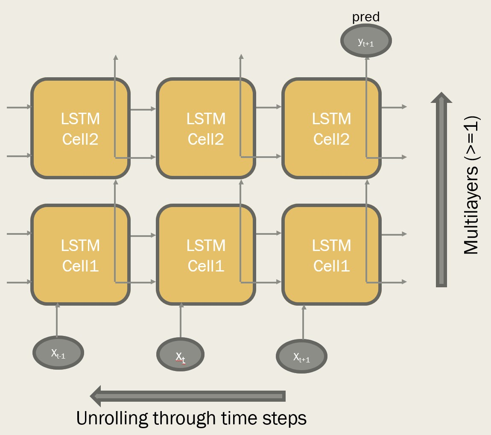
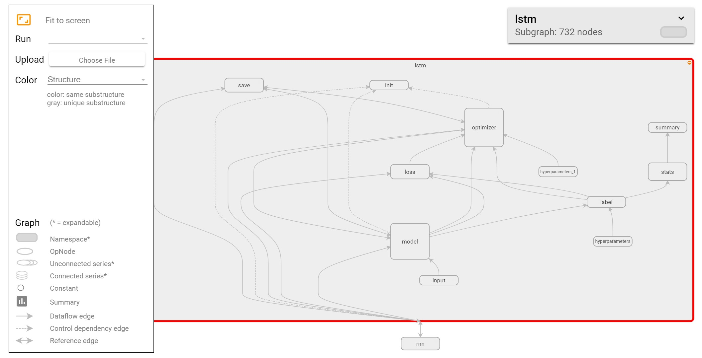

## Deep LSTM / GRU / RNN Framework for Financial Time-Series Prediction

Tony Tong (taotong@berkeley.edu, ttong@pro-ai.org)

### lstm.py
A high-level multi-layer LSTM recurrent neural network interface tailored for financial time-series prediction built on top of [TensorFlow](http://tensorflow.org) backend.  The class container also provides a convenient wrapper for GRU or basic RNN network as well. 



#### LSTM network

```python
# Build LSTM network
g = LSTM(n_input_features=10, batch_size=None, n_states=50, n_layers=2, n_time_steps=100, 
         l1_reg=0.05, l2_reg=0.01, start_learning_rate=0.001, decay_steps=1, decay_rate=0.3, 
         inner_iteration=10, forward_step=1)

# Using a generator data feeder and train 10 epochs
results = g.train(data_feeder=training_data_feeder, epoch_end=10, 
                  display_step=1, return_weights=True)

# Continue from previous trained state and train another 10 epochs
results = g.train(data_feeder=training_data_feeder, epoch_end=20, 
                  display_step=1, return_weights=True)
                  
# Continue training from a previously saved model from epoch 11 to 20
results = g.train(data_feeder=training_data_feeder, pre_trained_model='prev_model.ckpt', 
                  epoch_prev=10, epoch_end=20, display_step=1, return_weights=True)

# Reset previous state and train from scratch for 20 epochs
results = g.train(data_feeder=training_data_feeder, restore_model=False, 
                  epoch_end=20, display_step=1, return_weights=True)


# Use trained model to predict
predicted = g.predict(data_feeder=prediction_data_feeder)


# Alternatively, we can use batch data
results = g.train(batch_X=batch_X, batch_y=batch_y, in_sample_size=1600, epoch_end=50, 
                  display_step=1, return_weights=True)

predicted = g.predict(batch_X=batch_X)
```

#### GRU network

```python
g = GRU(n_input_features=10, batch_size=None, n_states=50, n_layers=2, n_time_steps=100, 
        l1_reg=0.05, l2_reg=0.01, start_learning_rate=0.001, decay_steps=1, decay_rate=0.3, 
        inner_iteration=10, forward_step=1)
```

#### Basic RNN network

```python
g = RNN(n_input_features=10, batch_size=None, n_states=50, n_layers=2, n_time_steps=100, 
        l1_reg=0.05, l2_reg=0.01, start_learning_rate=0.001, decay_steps=1, decay_rate=0.3, 
        inner_iteration=10, forward_step=1)
```

Show instance status:

```python
g.show_status()
```

Show tensorflow graph:

```python
g.show_graph()
```


